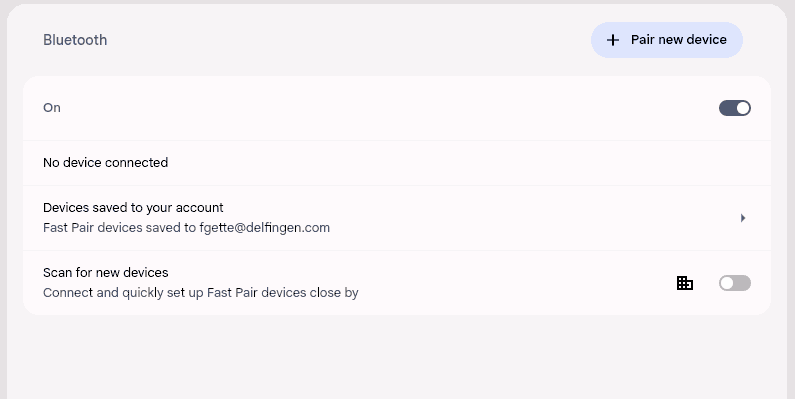

# wp81mouseJiggler
Turn your _Lumia 520_ into a kind of _Microsoft Bluetooth Mobile Mouse 3600_.

Example with a Chromebook (ASUS CX5601, chromeOS 134.0.6998.198)  
  
(animated gif optimized with [gifsicle](https://github.com/kohler/gifsicle))  

Example with Ubuntu 23.10 (Dell Latitude E5470)

