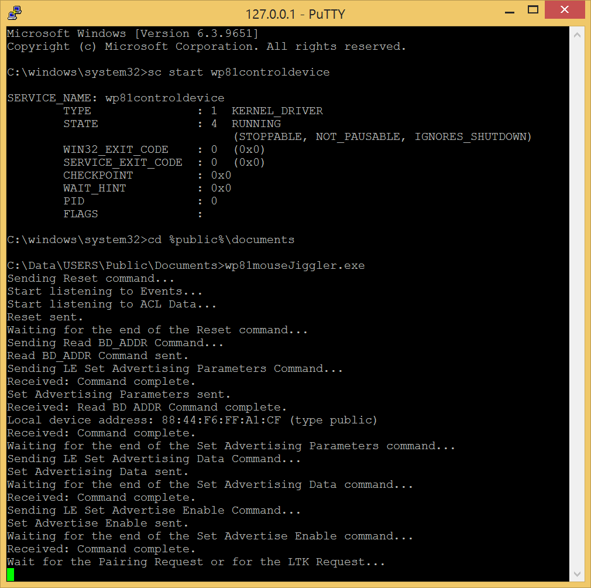

# wp81mouseJiggler
Turns your _Lumia 520_ into a kind of _Microsoft Bluetooth Mobile Mouse 3600_.  
There is no graphical interface as this is a Proof-of-Concept before another more polished version.  

Example of result with a Chromebook:   
  
(animated gif optimized with [gifsicle](https://github.com/kohler/gifsicle))  

## Usage

## Description

At the beginning of the program, the phone is in advertising mode. 
This advertising stops as soon as a connection is established with another device.  
- When the devices were not paired previously, then the phone receives a _Pairing Request_ and a [LE Legacy Pairing](#le-legacy-pairing) starts. Usually, this pairing is initiated by a user.   
- When the devices were paired previously, the phone directly receives a _LTK Request_ and the encryption of the connection starts. Usually, this connection doesn't require any user interaction. The _LTK Request_ contains the information given by the _Master Identification_ message during the previous pairing and the LTK(Long Term Key) is the one of the _Encryption Information_ message.  
  
At the end of the both cases, the connection is encrypted and the phone is ready to respond to the ATTributes requests. Then it starts to send the [notifications](#notification).   

<a name="le-legacy-pairing">LE Legacy Pairing:</a>  
| | mouse | | computer | |
|:-:|-:|:-:|:-|:-|
|1| | <- | Pairing Request | |
|2| Pairing Response | -> | | |
|3| | <- | Pairing Confirm | _Computed with a random value and information coming from the Pairing Request/Response and from the connection_ |
|4| Pairing Confirm | -> | | |
|5| | <- | Pairing Random | _Random value used to compute the Pairing Confirm_ |
|6| Pairing Random | -> | | |
|7| | <- | LTK Request | _The key of the request is 0x0000000000. In fact the computer requests the STK(Short Term Key)_ |
|8| LTK Request Reply | -> | | _Responding device must compute the same STK than the Initiating device_ |
|9| Encryption Information | -> | | _The real LTK_ |
|10| Master Identification | -> | | _A key to store the LTK_ |
|11| | <- | Signing Information | _Can be ignored_ |

The phone is acting like a mouse, and it is:  
- The Bluetooth Low Energy **Slave**
- The **Responding** device during the pairing process
- The Attribute **Server**

The computer (or any other device) is:  
- The Bluetooth Low Energy **Master**
- The **Initiator** device during the pairing process
- The Attribute **Client**

<a name="notification">Notification:</a>  
The format of a notification is described by the _Report Map_ send by the phone (on request from the other device).  
In our case, the content of a notification is the following:  

| Bytes | Description | 
|:-:|:-:|
|0| 5 Buttons, one bit for each button: 0b00011111 |
|1-2| Signed value of the X mouvement |
|3-4| Signed value of the Y mouvement |
|5-6| Signed value of the wheel mouvement |
|7-8| Signed value of a second wheel mouvement |

>[!NOTE]
>Some Attribute Clients (like ChromeOS) require a MTU(Maximum Transmission Unit) of 23 bytes.  
>In the case of the Lumia 520, it seems the number of messages lost increases when the Connection Interval is above 7.5ms (this is the minimum Connection Interval authorized).  
>Sometimes the notifications send by the phone are stalling. It looks like this is caused by a MIC(Message Integrity Check) error. When this problem is detected, the program automatically reset the connection.

>[!WARNING]
>For an unkown reason you have to reboot the phone when no connection is established during the advertising phase. Otherwise no further connection can be established during the next advertising phase.

Tested with the following configurations:
- Ubuntu 23.10 (Dell Latitude E5470)
- ChromeOS 134.0 (ASUS CX5601)
- Windows 10 Pro (Dell Latitude E5470)
- Windows 8.1 Pro (Dell Latitude E5470)
- Android 10 (Google Pixel)
- Android 15 (Google Pixel 7a)

## Deployment

- [Install a telnet server on the phone](https://github.com/fredericGette/wp81documentation/tree/main/telnetOverUsb#readme), in order to run the application.  
- Manually copy the executable from the root of this GitHub repository to the shared folder of the phone.
> [!NOTE]
> When you connect your phone with a USB cable, this folder is visible in the Explorer of your computer. And in the phone, this folder is mounted in `C:\Data\USERS\Public\Documents`

This program requires **the kernel drivers "wp81controldevice.sys" and "wp81hcifilter.sys"**  
See [wp81btmon](https://github.com/fredericGette/wp81btmon/tree/main?tab=readme-ov-file#installation-of-the-kernel-drivers-wp81controldevicesys-and-wp81hcifiltersys) for their installation.  
